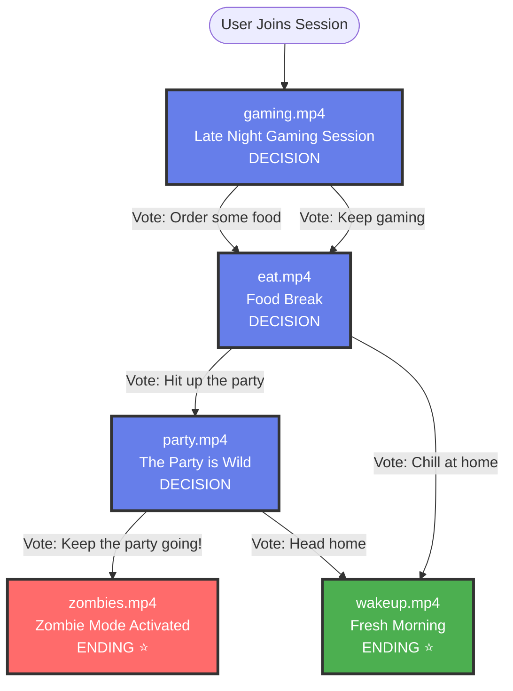

# Interactive Video Story Flow

## Visual Story Map

This document provides a visual representation of the branching narrative structure configured in `story-config.json`.

---

## Story Flow Diagram



---

## Story Structure Summary

### Nodes Overview

| Node ID | Type | Title | Video File | Choices |
|---------|------|-------|------------|---------|
| `gaming` | Decision | Late Night Gaming Session | gaming.mp4 | 2 options |
| `eat` | Decision | Food Break | eat.mp4 | 2 options |
| `party` | Decision | The Party is Wild | party.mp4 | 2 options |
| `zombies` | Ending | Zombie Mode Activated | zombies.mp4 | - |
| `wakeup` | Ending | Fresh Morning | wakeup.mp4 | - |

**Total Nodes**: 5
**Decision Nodes**: 3
**Ending Nodes**: 2
**Maximum Story Depth**: 4 videos (gaming → eat → party → ending)

---

## Story Paths

### Path 1: Gaming → Eating → Partying → Zombies
```
1. gaming.mp4 (Late Night Gaming Session)
   ↓ Vote: "Order some food" OR "Keep gaming a bit longer"
2. eat.mp4 (Food Break)
   ↓ Vote: "Hit up the party"
3. party.mp4 (The Party is Wild)
   ↓ Vote: "Keep the party going!"
4. zombies.mp4 (Zombie Mode Activated) ⭐
```
**Outcome**: Partied too hard and became a zombie the next day!

### Path 2: Gaming → Eating → Stay Home → Fresh Morning
```
1. gaming.mp4 (Late Night Gaming Session)
   ↓ Vote: "Order some food" OR "Keep gaming a bit longer"
2. eat.mp4 (Food Break)
   ↓ Vote: "Chill at home instead"
3. wakeup.mp4 (Fresh Morning) ⭐
```
**Outcome**: Made the smart choice to stay in and woke up refreshed!

### Path 3: Gaming → Eating → Partying → Smart Exit
```
1. gaming.mp4 (Late Night Gaming Session)
   ↓ Vote: "Order some food" OR "Keep gaming a bit longer"
2. eat.mp4 (Food Break)
   ↓ Vote: "Hit up the party"
3. party.mp4 (The Party is Wild)
   ↓ Vote: "Head home and get some sleep"
4. wakeup.mp4 (Fresh Morning) ⭐
```
**Outcome**: Enjoyed the party but left at the right time!

---

## Decision Points

### Decision 1: Late Night Gaming Session (gaming)
**Question**: You've been gaming for hours. What's next?

| Option ID | Button Text | Next Node | Leads To |
|-----------|-------------|-----------|----------|
| `order_food` | "Order some food" | `eat` | Food break scene |
| `keep_gaming` | "Keep gaming a bit longer" | `eat` | Food break scene (same outcome) |

**Expected Duration**: ~20-30 seconds video + 10-20 seconds voting
**Context**: Late night gaming session setting the scene

---

### Decision 2: Food Break (eat)
**Question**: Your friends are texting. What do you do?

| Option ID | Button Text | Next Node | Outcome |
|-----------|-------------|-----------|---------|
| `go_to_party` | "Hit up the party" | `party` | Party scene |
| `chill_at_home` | "Chill at home instead" | `wakeup` | Fresh morning ending |

**Expected Duration**: ~20-30 seconds video + 10-20 seconds voting
**Context**: Food delivered/eaten, now deciding on social plans

**Note**: This is the first major branching point that can lead to an early good ending!

---

### Decision 3: The Party is Wild (party)
**Question**: It's 3 AM and things are getting crazy. What do you do?

| Option ID | Button Text | Next Node | Ending Type |
|-----------|-------------|-----------|-------------|
| `keep_partying` | "Keep the party going!" | `zombies` | Zombie Mode Activated (bad ending) |
| `go_home` | "Head home and get some sleep" | `wakeup` | Fresh Morning (good ending) |

**Expected Duration**: ~20-30 seconds video + 10-20 seconds voting
**Context**: Peak party scene, final choice determines fate

**Note**: This is the critical decision - party too long = zombies!

---

## Video Requirements

### Required Videos (5 total)

**Decision Videos (3)**:
1. `gaming.mp4` - Late night gaming session intro
2. `eat.mp4` - Food break and social invitation
3. `party.mp4` - Wild party scene at 3 AM

**Ending Videos (2)**:
4. `zombies.mp4` - Zombie mode activated (exhausted/hungover)
5. `wakeup.mp4` - Fresh morning (well-rested)

### Video Specifications

**CRITICAL REQUIREMENTS**:
- **Format**: MP4 (H.264 codec)
- **Resolution**: **1280x720 (720p)** - MANDATORY
- **Aspect Ratio**: **16:9 landscape** - MANDATORY
- **Recommended Length**: 20-40 seconds each
- **Frame Rate**: 30fps or 60fps
- **Total Combined Size**: Ideally <50MB for Git deployment

**Upload Folder**: `apps/server/videos/uploads/` (any size/resolution)
**Processing**: Videos will be auto-converted to 720p landscape
**Final Folder**: `apps/server/public/videos/` (ready for deployment)

---

## Story Statistics

### Narrative Metrics
- **Total Unique Paths**: 3 complete stories
- **Average Path Length**: 3-4 videos (~60-120 seconds + voting time)
- **Branching Factor**: 2 choices per decision
- **Replayability**: High (2 different endings with multiple paths)

### Engagement Metrics
- **Minimum Experience Time**: ~2 minutes (quick votes)
- **Maximum Experience Time**: ~5 minutes (with discussion)
- **Voting Rounds**: 2-3 per complete story
- **Total Decisions**: 2-3 per viewer

### Content Distribution
```
Shared Content:     2 videos (gaming, eat)
Party Branch:       1 video (party)
Zombie Ending:      1 video (zombies)
Wakeup Ending:      1 video (wakeup)
Total Unique:       5 videos
```

### Ending Statistics
- **Zombie Ending** (Bad): 1 path (33%)
- **Wakeup Ending** (Good): 2 paths (67%)

Players have two chances to avoid the zombie ending!

---

## Story Themes

### Theme: Decision Making & Consequences
This interactive narrative explores:
- **Social pressure**: Friends inviting you out vs. staying in
- **Time management**: Knowing when to call it a night
- **Self-care**: Balancing fun with health/rest
- **FOMO**: Fear of missing out vs. making smart choices

### Tone
- Lighthearted and relatable
- Modern/contemporary setting
- Humor in the "zombie mode" bad ending
- Positive reinforcement for healthy choices

---

## Extending the Story

### Adding More Branches at Gaming
To add a third option at the gaming decision:

```json
{
  "id": "gaming",
  "options": [
    { "id": "order_food", "text": "Order some food", "nextNodeId": "eat" },
    { "id": "keep_gaming", "text": "Keep gaming a bit longer", "nextNodeId": "eat" },
    { "id": "stream_game", "text": "Start streaming", "nextNodeId": "streaming_path" }
  ]
}
```

Then add a streaming branch with its own paths and endings.

### Adding More Party Outcomes
Could add a third option at the party:

```json
{
  "id": "party",
  "options": [
    { "id": "keep_partying", "text": "Keep the party going!", "nextNodeId": "zombies" },
    { "id": "go_home", "text": "Head home and get some sleep", "nextNodeId": "wakeup" },
    { "id": "afterparty", "text": "Move to the afterparty", "nextNodeId": "afterparty_ending" }
  ]
}
```

This creates more variety and replayability!

---

## Video Processing Pipeline

### Folder Structure
```
apps/server/videos/
├── uploads/          # Raw videos (any size/format)
├── processed/        # Converted to 720p landscape
└── public/videos/    # Final videos for deployment
```

### Processing Workflow

1. **Upload**: Place raw videos in `uploads/` folder
2. **Convert**: Run conversion script to convert to 720p landscape
3. **Verify**: Check processed videos meet specs
4. **Deploy**: Processed videos moved to `public/videos/`

### Conversion Script
Run: `npm run process-videos`

This will:
- Check all videos are landscape 16:9
- Convert to 1280x720 if needed
- Ensure H.264 codec
- Optimize file size
- Move to final destination

---

## Story Design Best Practices

### For Engaging Narratives

1. **Clear Choices**: Make options distinct and meaningful
   - ✅ "Keep partying" vs "Go home" (clear consequences)
   - ❌ "Stay a bit" vs "Stay longer" (too similar)

2. **Relatable Scenarios**: Use situations viewers understand
   - Gaming, eating, partying are universal experiences
   - Modern context resonates with audiences

3. **Pacing**: Keep videos 20-40 seconds
   - Long enough to set the scene
   - Short enough to maintain attention

4. **Consequence**: Each choice should matter
   - Going home early = good ending
   - Partying too long = zombie mode

5. **Humor**: Light consequences make it fun
   - "Zombie mode" is funny, not scary
   - Fresh morning feels rewarding

### For Technical Performance

1. **File Size**: Keep individual videos under 10MB
2. **Length**: 20-40 seconds optimal for voting windows
3. **Consistent Style**: Same resolution/aspect ratio
4. **Loading Time**: Pre-load next possible videos

### For Voting Dynamics

1. **2-3 Options**: More than 3 can slow decisions
2. **Clear Labels**: Button text should be 3-6 words
3. **Time Limit**: 20-30 second voting window
4. **Tie-Breaker**: Random selection for equal votes

---

## Validating Your Story

### Automated Validation

The StoryGraphManager automatically validates:
- ✅ Start node exists (`gaming`)
- ✅ All decision nodes have options
- ✅ All ending nodes have no options
- ✅ All nextNodeId references are valid
- ✅ No orphaned nodes (unreachable from start)

### Manual Validation Checklist

Before deployment:
- [ ] All 5 video files exist in `apps/server/public/videos/`
- [ ] All videos are 720p landscape (1280x720)
- [ ] Filenames match `story-config.json` exactly
- [ ] Each path is playable end-to-end
- [ ] All endings are reachable
- [ ] Button text is clear and concise
- [ ] Video quality is consistent
- [ ] Total file size is acceptable (<50MB)

### Testing Command

```bash
curl http://localhost:3000/api/stats
```

Expected response:
```json
{
  "storyStats": {
    "totalNodes": 5,
    "decisionNodes": 3,
    "endingNodes": 2,
    "orphanedNodes": 0
  }
}
```

**Warning**: If `orphanedNodes > 0`, you have unreachable content!

---

## Quick Reference

**Story Config**: `apps/server/story-config.json`
**Video Upload**: `apps/server/videos/uploads/`
**Video Processing**: `apps/server/videos/processed/`
**Final Destination**: `apps/server/public/videos/`
**Validation**: `GET /api/stats`
**Story Manager**: `apps/server/src/services/StoryGraphManager.ts`

---

## Video Checklist

### Videos Needed (5)
- [ ] gaming.mp4 - Gaming session intro (720p landscape)
- [ ] eat.mp4 - Food break scene (720p landscape)
- [ ] party.mp4 - Wild party scene (720p landscape)
- [ ] zombies.mp4 - Zombie mode ending (720p landscape)
- [ ] wakeup.mp4 - Fresh morning ending (720p landscape)

### Processing Steps
1. [ ] Upload raw videos to `apps/server/videos/uploads/`
2. [ ] Run `npm run process-videos` to convert to 720p
3. [ ] Verify all videos are 1280x720 landscape
4. [ ] Check file sizes are reasonable (<10MB each)
5. [ ] Move processed videos to `apps/server/public/videos/`
6. [ ] Test story flow locally
7. [ ] Commit videos to Git (if using deployment Option 1)
8. [ ] Deploy to production

---

*Last Updated: October 25, 2025*
*Story: Gaming → Eating → Party → Zombies/Wakeup*
*For video processing guide, see VIDEO_PROCESSING.md*
